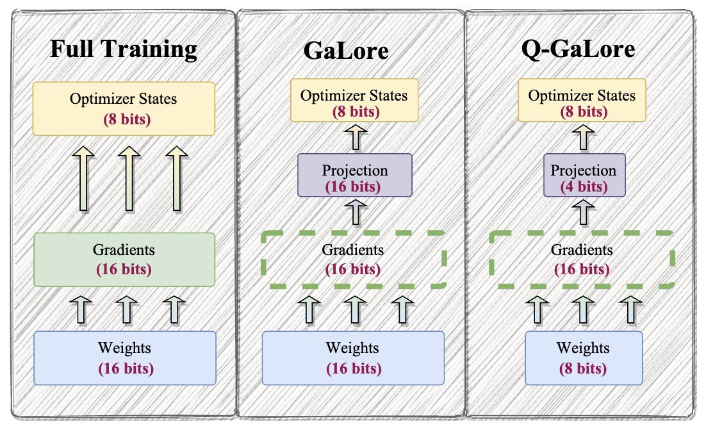

# Q-GaLore

This repo contains the pre-release version of Q-GaLore algorithm, proposed by Q-GaLore: Quantized GaLore with INT4 Projection and Layer-Adaptive Low-Rank Gradients. 

Q-GaLore is a memory-efficient training methodology effective in both pre-training and fine-tuning scenarios. Q-GaLore incorporates two main components: (i) low precision training utilizing low-rank gradients, and (ii) lazy layer-wise subspace exploration. It enables full-parameter learning while requiring less memory, such as training a LLaMA-7B model from scratch on a single NVIDIA RTX 4060 Ti with only 16GB of memory.

<div align="center">
  
</div>

### Install Q-GaLore optimizer

Install from pip:

```bash
pip install q-galore-torch
```

or if you want to install from source:

```bash
git clone https://github.com/VITA-Group/Q-GaLore.git
cd Q-GaLore
pip install -e .
```

### Install experiment dependencies

```bash
pip install -r exp_requirements.txt
```

## Usage

## Citation

```bibtex
TBD
```
